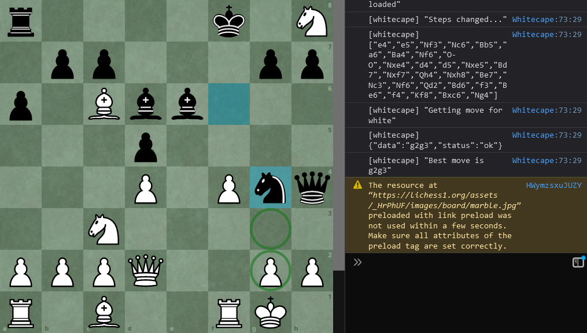

 

  
<h3>Whitecape</h3>
  <i>A proof-of-concept of a chess helper</i>

## Disclaimer
**DO NOT USE** in ranked games or you'll get banned, actually don't even use it in casual games. This script is not intended for cheating your way up to a high ELO, but rather to help you learn good chess.

Here is a [example account](https://lichess.org/@/GetYourMoneyBack) I made, which played five perfect matches (except for one where I blundered a pawn) against some high rated opponents. The account is now banned.

## About
### For users
A [Greasemonkey](https://en.wikipedia.org/wiki/Greasemonkey) script that will give you _the best next move_ (provided by Stockfish) in a lichess game.

### For developers
Source code of the script and a flask API that runs stockfish.

## Installation
### For users
1. Install [Greasemonkey](https://addons.mozilla.org/en-US/firefox/addon/greasemonkey) (firefox) or [Tampermonkey](https://chrome.google.com/webstore/detail/tampermonkey/dhdgffkkebhmkfjojejmpbldmpobfkfo) (chrome or others).
2. Navigate to [https://www.cattaneo.uy/whitecape/whitecape.user.js](https://www.cattaneo.uy/whitecape/whitecape.user.js). You'll get prompted with an installation form.
3. Go to [Lichess](https://lichess.org) and try it out.

### For developers
First clone this repository.
#### Script
1. Install [Greasemonkey](https://addons.mozilla.org/en-US/firefox/addon/greasemonkey) (firefox) or [Tampermonkey](https://chrome.google.com/webstore/detail/tampermonkey/dhdgffkkebhmkfjojejmpbldmpobfkfo) (chrome or others).
2. Add [scripts/whitecape.user.js](scripts/whitecape.user.js) to your plugin. Feel free to modify anything, especially the API URL if you intend to change it.

#### API
1. Install [Stockfish](https://stockfishchess.org/download). You'll need a full path to its main program.
2. Modify [api/.env.tmp](api/.env.tmp), changing `stockfish-path` to yours. On windows could be _c:\stockfish\stockfish.exe_, on *unix _/usr/bin/stockfish_
3. Rename _.env.tmp_ to _.env_
4. If you want to use docker, just skip those steps and build the [provided dockerfile](api/Dockerfile).
5. Install requirements with `python -r api/requirements.txt`
6. Run with `python api/main.py`

## License
GPL v3
